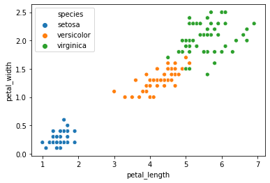

# Jupyter notebook README example

This README was created with Jupyter.

This is an example repo to demo a possible workflow to use a Jupyter notebook as a README on GitHub.  This feature has been requested for GitHub to add, but I don't think it has been added yet. The method will be to add a cell at the end of the notebook with the below command.

```bash
!jupyter nbconvert --to markdown README.ipynb
```

Read [the documentation](https://nbconvert.readthedocs.io/en/latest/usage.html#convert-markdown) for more info on `jupyter nbconvert`.

## Steps

1. Name the notebook `'README.ipynb'`
  * Not needed if you do step 4 instead
* Add the following code to as the last cell in the notebook: `!jupyter nbconvert --to markdown README.ipynb`
  * If you didn't do step one, change `'README.ipynb'` to the name of your notebook
* Run your notebook (be sure the last cell with the `nbconvert` runs)
* Rename the output to `'README.md'`
  * Not needed if you did step 1
  * Could be done by adding the following line (below the `nbconvert` to avoid needing to manually rename): `os.rename('name_of_your_notebook.ipynb', dst='README.md')`
  
## Example Output:


```python
import pandas as pd
import numpy as np
import seaborn as sns
import matplotlib.pyplot as plt
%matplotlib inline


iris = sns.load_dataset('iris')
iris.head()
```


<div>
<style scoped>
    .dataframe tbody tr th:only-of-type {
        vertical-align: middle;
    }

    .dataframe tbody tr th {
        vertical-align: top;
    }

    .dataframe thead th {
        text-align: right;
    }
</style>
<table border="1" class="dataframe">
  <thead>
    <tr style="text-align: right;">
      <th></th>
      <th>sepal_length</th>
      <th>sepal_width</th>
      <th>petal_length</th>
      <th>petal_width</th>
      <th>species</th>
    </tr>
  </thead>
  <tbody>
    <tr>
      <th>0</th>
      <td>5.1</td>
      <td>3.5</td>
      <td>1.4</td>
      <td>0.2</td>
      <td>setosa</td>
    </tr>
    <tr>
      <th>1</th>
      <td>4.9</td>
      <td>3.0</td>
      <td>1.4</td>
      <td>0.2</td>
      <td>setosa</td>
    </tr>
    <tr>
      <th>2</th>
      <td>4.7</td>
      <td>3.2</td>
      <td>1.3</td>
      <td>0.2</td>
      <td>setosa</td>
    </tr>
    <tr>
      <th>3</th>
      <td>4.6</td>
      <td>3.1</td>
      <td>1.5</td>
      <td>0.2</td>
      <td>setosa</td>
    </tr>
    <tr>
      <th>4</th>
      <td>5.0</td>
      <td>3.6</td>
      <td>1.4</td>
      <td>0.2</td>
      <td>setosa</td>
    </tr>
  </tbody>
</table>
</div>


```python
sns.scatterplot(x='petal_length',
                y='petal_width', 
                hue='species', 
                data=iris)
plt.show()
```





    ---------------------------------------------------------------------------

    NameError                                 Traceback (most recent call last)

    <ipython-input-2-bd4d5bbba26c> in <module>
          5 plt.show()
          6 
    ----> 7 __file__
    

    NameError: name '__file__' is not defined


```python
!jupyter nbconvert --to markdown README.ipynb
```
